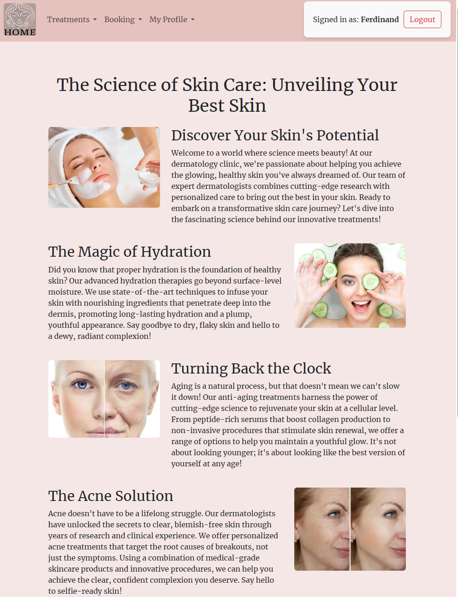

# Eternal Glow


*A private sector dermatology clinic.*
## Description

**Eternal Glow** is a private sector dermatology clinic specializing in skincare services. Our mission is to provide top-notch dermatological care accessible to a broader audience through our online platform.

### Brief Overview

Clients can:

- **Register** for a personalized account.
- **Book** appointments for a variety of skincare services.
- **Manage** their bookings and account details with full CRUD (Create, Read, Update, Delete) functionalities.

### Motivation

The motivation behind Eternal Glow's website is to extend our reach and make our services accessible to clients outside our immediate area. We aim to provide a seamless online experience for booking and managing skincare appointments.

### Problem It Solves

By offering an online platform, Eternal Glow overcomes geographical limitations, allowing the clinic to connect with clients who might not have discovered our services otherwise. This enhances convenience for clients and expands our business footprint.

## Installation

### Prerequisites

Before installing **Eternal Glow**, ensure you have the following software and tools installed:

- **Python 3.7+**
- **pip** (Python package manager)
- **virtualenv** (optional but recommended)

The project requires the following Python packages:

```plaintext
asgiref==3.8.1
certifi==2024.8.30
cffi==1.17.1
charset-normalizer==3.3.2
crispy-bootstrap5==2024.2
cryptography==43.0.1
dj-database-url==2.2.0
Django==5.1
django-allauth==64.2.0
django-crispy-forms==2.3
gunicorn==23.0.0
idna==3.8
oauthlib==3.2.2
packaging==24.1
pillow==10.4.0
psycopg2-binary==2.9.9
pycparser==2.22
PyJWT==2.9.0
python-decouple==3.8
requests==2.32.3
requests-oauthlib==2.0.0
sqlparse==0.5.1
stripe==10.11.0
typing_extensions==4.12.2
tzdata==2024.1
urllib3==2.2.2
whitenoise==6.7.0
```
### Installation Steps

Follow these steps to set up **Eternal Glow** on your local machine:

**Clone the Repository**

   Clone the project from the repository to your local machine:

   ```bash
   git clone https://github.com/RimPeter/Eternal-Glow.git
   cd eternal-glow
```
Create a Virtual Environment (optional but recommended)

Create and activate a virtual environment to manage dependencies:

On macOS and Linux:

```bash
Copy code
python3 -m venv venv
source venv/bin/activate
```
On Windows:

```bash
Copy code
python -m venv venv
venv\Scripts\activate
```
Install Dependencies

Install all required Python packages using pip:

```bash
Copy code
pip install -r requirements.txt
```
Set Up Environment Variables

Create a .env file in the project root directory to store environment variables:

```bash
Copy code
touch .env
```
Add the necessary configurations to the .env file:

```dotenv
Copy code
DEBUG=True
SECRET_KEY=your_secret_key_here
DATABASE_URL=sqlite:///db.sqlite3
```
Note: Replace your_secret_key_here with a securely generated secret key.

Apply Database Migrations

Apply migrations to set up the database schema:

```bash
Copy code
python manage.py migrate
```
Create a Superuser (optional)

If you want to access the Django admin panel, create a superuser account:

```bash
Copy code
python manage.py createsuperuser
```
Collect Static Files

Collect all static files into a single directory:

```bash
Copy code
python manage.py collectstatic
```
Note: When prompted, type yes to confirm.

Run the Development Server

Start the Django development server:

```bash
Copy code
python manage.py runserver
```
Access the Application

Open your web browser and navigate to:

```url
Copy code
http://127.0.0.1:8000/
```
## Usage

### Basic Usage

**Eternal Glow** provides a user-friendly interface for clients to manage their skincare needs effortlessly. Here’s how you can navigate and utilize the platform:

1. **Register an Account**
   - Navigate to the **Register** page.
   - Fill in the required details to create a new account.
   
2. **Login**
   - Go to the **Login** page.
   - Enter your credentials to access your personalized dashboard.
   
3. **Browse Services**
   - Explore the range of skincare treatments and services offered.
   
4. **Create a Booking**
   - Select your desired service and choose a convenient time slot.
   - Confirm your booking details to secure your appointment.
   
5. **Manage Bookings**
   - View your upcoming appointments in the **Booking List**.
   - Update or cancel your bookings as needed through the **Manage Booking** section.

### Screenshots/Demos

Visual representations can help you better understand the workflow and features of **Eternal Glow**. Below are screenshots showcasing various parts of the application:

- **Home Page**

  

  *The welcoming home page provides an overview of our services and easy navigation options.*

- **Services Page**

  

  *Browse through our comprehensive list of skincare treatments tailored to your needs.*

- **Registration Page**

  

  *Create a new account by providing your personal information.*

- **Login Page**

  

  *Access your account securely using your registered credentials.*

- **Create Booking**

  

  *Select a service and schedule your appointment with ease.*

- **Booking List**

  

  *View all your upcoming and past bookings in one place.*

- **Manage Booking**

  

  *Update or cancel your appointments directly from the management interface.*

## Facebook Business Page

Connect with **Eternal Glow** on our official [Facebook Business Page](https://www.facebook.com/eternalglowclinic) to stay updated with the latest news, skincare tips, and exclusive offers.


### Why Follow Us on Facebook?

- **Stay Informed**: Receive real-time updates about our services, promotions, and events.
- **Expert Insights**: Access valuable skincare advice and tips from our experienced dermatologists.
- **Community Engagement**: Join a community of like-minded individuals who are passionate about skincare and wellness.
- **Exclusive Content**: Enjoy special content, including tutorials, behind-the-scenes looks, and client testimonials.
- **Interactive Support**: Get your questions answered and receive personalized recommendations directly through our Facebook page.

### How to Connect

1. **Visit Our Page**: Click on the [Eternal Glow Facebook Page](https://www.facebook.com/eternalglowclinic) link.
2. **Like and Follow**: Click the "Like" and "Follow" buttons to start receiving updates.
3. **Engage with Us**: Like, comment, and share our posts to engage with our community and stay involved.

By following our Facebook Business Page, you'll be the first to know about new services, special discounts, and important announcements. Join our online community today and take a step towards achieving radiant and healthy skin with **Eternal Glow**!

---


